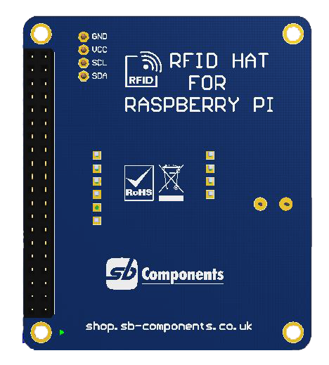

# SB-RFID-HAT
This is a Raspberry Pi RFID HAT Module operating in the 125Khz frequency range. It supports two communication interfacs: UART for RFID and I2C for Oled Display.

   

## Features

* Standard Raspberry Pi 40PIN GPIO extension header, supports Raspberry Pi series boards
* Two interface options: UART for RFID, I2C for Oled Display
* User configurable buzzer (connected on GPIO 17 of Raspberry pi)

#### You can also use these 2 projects available in this repository with this hat:

* Attendance_system : A GUI based attendance system using our rfid hat and rfid tags/cards.
* Lock_Pi : You can use this project to log-ff raspberry pi using this rfid hat. To login you have to manually type password to log on again.

## How To configure ? 

### Enable i2c and Serial interface

I2C/Serial interface is disabled by default in Raspberry Pi, To enable it type below command.

``` sudo raspi-config ```

* Now select Interfacing options.
* Now we need to select I2C option.
* Now select Yes and press enter and then ok.

To enable serial,

* select interfacing options.
* Now we need to select serial.
* select no to disable serial over login shell.
* Now select yes to enable serial hardware port then ok.

After this step reboot raspberry by typing below command:

``` sudo reboot ```

### Install Required Libraries

* sudo apt-get install python-smbus
* sudo apt-get install i2c-tools

To verify the list of connected device on I2C interface, you can run below commond :

``` sudo i2cdetect -y 1 ```

### How to run SB-PI-HAT examples

To run examples of SB-PI-HAT, clone this repository by executing below command

``` git clone https://github.com/sbcshop/SB-RFID-HAT.git ```

``` cd SB-RFID-HAT ```

``` python3 rfid.py ``` (Without Oled display, output on terminal/shell)
     
   OR
     
``` python3 rfid_with_oled.py ``` ( To show detected tag id on Oled as well as on terminal/shell)

### Video Tutorial

<div align="center">
      <a href="https://www.youtube.com/watch?v=8P8CC5TtLy0">
     
      </a>
    </div>

